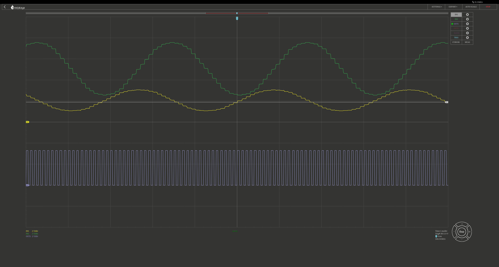

# Examples

All of the examples in this folder use a
[Pico de Gallo] to communicate with the chip.
These were all tested using the [LTC2686 dev board].
The controller board is not required to use the [LTC2686 dev board]
with these examples.

If you do not have a Pico de Gallo,
use can provide any SPI/GPIO interface that implements
[embedded-hal] and/or [embedded-hal-async] traits.

All examples, unless otherwise noted,
use the `async` interface
and reset the chip after initialization using the `nCLR` pin.
Furthermore: all examples that have a filename starting with `ll`
interact with the low-level driver,
which is written using [device-driver].

## Overview

The following shows and overview and a brief description of all the examples.
Documentation within the example gives you more information.
All examples are listed in order of potential interest/complexity.

### Low-level driver examples

- `ll_simple.rs`: Starting example. Setup, reset, set/get a channel code.
- `ll_span.rs`: Set up two channels with different voltage ranges.
- `ll_toggle.rs`: Runs the LTC2686 in (software) toggle mode.
- `ll_dither.rs`: Runs the LTC2686 in (software) dither mode.
- `ll_dither_ext.rs`*: Dither mode with external trigger for two channels.

Examples with a * have further details shown below.

## Connections

The following connections are, at a minimum, required to make the examples work.
Additional connection requirements, if needed, are mentioned in the documentation
on top of each example.

### Pico de Gallo

All SPI connections should be fairly self-explanatory.
`GPIO 0` is used to drive the chip select pin.
`GPIO 1` is used to drive the clear pin and thus to reset the chip upon request.

| Pico de Gallo  | LTC2686 |
| -------------- | ------- |
| `+3.3V`        | `IOVcc` |
| `GND`          | `GND`   |
| `SPI TX (MOSI)`| `SDI`   |
| `SPI RX (MISO)`| `SDO`   |
| `SPI SCK`      | `SCK`   |
| `GPIO 0`       | `nCS`   |
| `GPIO 1`       | `nCLR`  |

### External voltages

Make sure that all power supplies are grounded!
At a minimum the following voltages were used for the setup.

- `Vcc`: +5V
- `V1+`: +15V

If you only want to produce positive ranges, tie `V-` to `GND`.
Otherwise, supply a negative `V-` voltage.

### [LTC2686 dev board] jumpers

- `JP1`: Use internal reference.
- `JP2` - `JP4`: Toggle inputs: generally left unchanged, unless otherwise noted.
- `JP5`: Set to connect (`V1+` internally connected to `V2+`).

## Further details on examples

### `ll_dither_ext.rs`

This examples sets up the channels as following in dither mode:

- Channel 0:
  - Span: 0-5V.
  - Baseline voltage: 2V.
  - Amplitude: 1V.
  - Period: 32 triggers.
  - Phase shift: 0deg.
- Channel 1:
  - Span: 0-10V.
  - Baseline voltage: 5V.
  - Amplitude: 2.5V.
  - Period: 32 triggers.
  - Phase shift: 90deg.

Using a signal generator and oscilloscope we can do the following:

- Generate a 10kHz square wave (0 - 3.3V) and connect it to TPG2.
- Record outputs of Channel 0 and 1 on inputs IN1 and IN2, respectively.

The following image shows a recording of this signal.

The horizontal axes shows 1ms/div and the vertical 2V/div.
The LTC2686 is doing exactly what we set it up to do.

[device-driver]: https://device-driver.com/
[embedded-hal]: https://docs.rs/embedded-hal/latest/embedded_hal/
[embedded-hal-async]: https://docs.rs/embedded-hal-async/latest/embedded_hal_async/
[LTC2686 dev board]: https://www.analog.com/en/resources/evaluation-hardware-and-software/evaluation-boards-kits/dc2904a.html
[Pico de Gallo]: https://balbi.sh/pico-de-gallo
